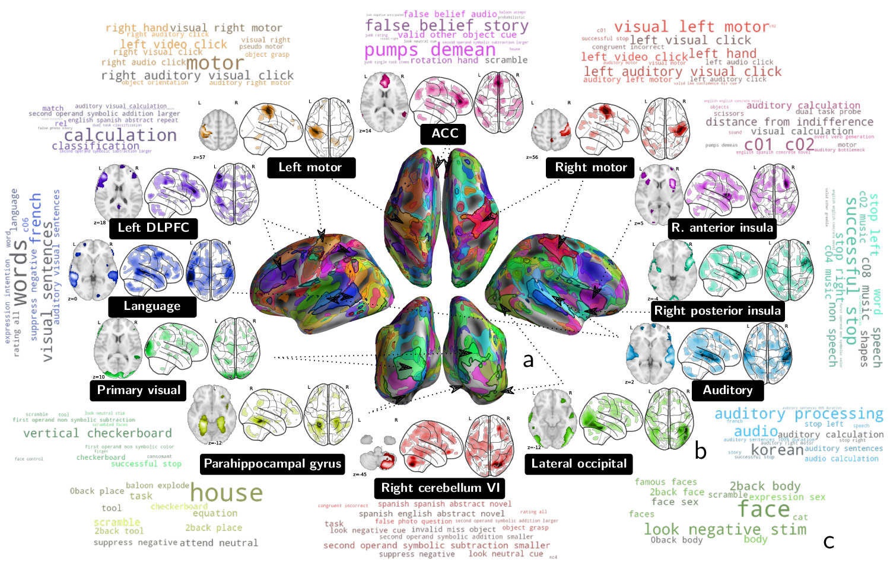

<!--
Copied from cogspaces.github.io 

See github.com/cogspaces/cogspaces.github.io
-->

# Cogspaces

Multi-study decoding models for task functional MRI data. [Website](https://cogspaces.github.io)

The cogspace package allows to reproduce and reuse the multi-study task functional MRI decoding models presented in this [preprint paper](https://arxiv.org/abs/1809.06035).

# A new decoding approach

Our multi-study decoding model decodes mental states from statistical maps using a three-layer linear model that finds successive representations of brain maps that carry cognitive information. It finds task-optimized networks from which decoding generalize well across subjects.


This approach allows to transfer cognitive information from one task fMRI study to another, and significantly increases decoding accuracy for many studies.


It also finds meaningful cognitive directions, readily associated to the labels they encourage to classify.



# Software

Cogspaces is tested with Python 3.6+.

## Install

```bash
git clone github.com/arthurmensch/cogspaces
cd cogspaces
pip install -r requirements.txt
python setup.py install
```

## Training and using multi-study models

`exps/train.py` allows to train and analyse multi-study models.

```bash
cd exps
python train.py
```

```
usage: train.py [-h] [-e {ensemble,logistic,factored}] [-s SEED] [-p]

Perform traininig of a multi-study model using the fetchers provided by
cogspaces. Hyperparameters can be edited in the file.

optional arguments:
  -h, --help            show this help message and exit
  -e {ensemble,logistic,factored}, --estimator {ensemble,logistic,factored}
                        estimator type
  -s SEED, --seed SEED  Integer to use to seed the model and half-split cross-
                        validation
  -p, --plot            Plot the results (classification maps, cognitive
                        components)
```

A comparison grid between the factored model and decoding models from resting-state loadings can be run and analyzed with the following command:

```bash
cd exps
python grid.py
# Plot results
python compare.py
```

Note that the original figure of the paper compares the multi-study decoder to voxelwise, single-study decoder. As the input data for this baseline is large and requires to be downloaded and processed, we propose to reproduce a comparison with only reduced data as input.

Reduction of full statistical maps into data usable in `train.py` can be performed with the command:

```bash
cd exps
python reduce.py
```

Once obtained, a voxelwise decoder can be trained by changing the parameter `config['data']['reduced'] = True` in `train.py`. 

# Data

We provide resting-state dictionaries for reducing statistical maps (the first layer of the model), as well as the reduced representation of the input statistical maps, and fetchers for the full statistical maps.

## Resting-state dictionaries

The dictionaries extracted from HCP900 resting-state data can be download running

```python
from cogspaces.datasets import fetch_dictionaries

dictionaries = fetch_dictionaries()
# dictionaries = {'components_64': ...}
```

They were obtained using the [modl](https://github.com/arthurmensch/modl) package. They may also be downloaded manually 
- [64-components dictionary covering the whole brain](assets/data/modl/components_64.nii.gz)
- [128-components dictionary covering the whole brain](assets/data/modl/components_128.nii.gz)
- [453-components dictionary covering the grey-matter](assets/data/modl/components_453_gm.nii.gz)
- [128-components dictionary loadings over the 453-components dictionary](assets/data/modl/loadings_128_gm.npy)

## Reduced representation of the 35 studies

The loadings of the z-statistic maps over the 453-components dictionary can be loaded running

```python
from cogspaces.datasets import load_reduced_loadings

Xs, ys = load_reduced_loadings()
print(Xs)
# {'archi': np.array(...), 'hcp': np.array(...)}
print(ys)
# {'archi': pd.DataFrame}, ...)
print(ys['archi'].columns)
# ['study', 'subject', 'task', 'contrast']
```

The full statistical maps are available on Neurovault, and may be downloaded using

```python
from cogspaces.datasets import fetch_contrasts

df = fetch_contrasts('archi')
print(df.columns)
# ['z_map', 'study', 'subject', 'task', 'contrast']
df = fetch_contrasts('all')
```


# Publications

If the model or data proved useful, please consider to cite the following paper

- Mensch, A., Mairal, J., Thirion, B., & Varoquaux, G. (2018). 
Extracting Universal Representations of Cognition across Brain-Imaging Studies.
arXiv: 1809.06035